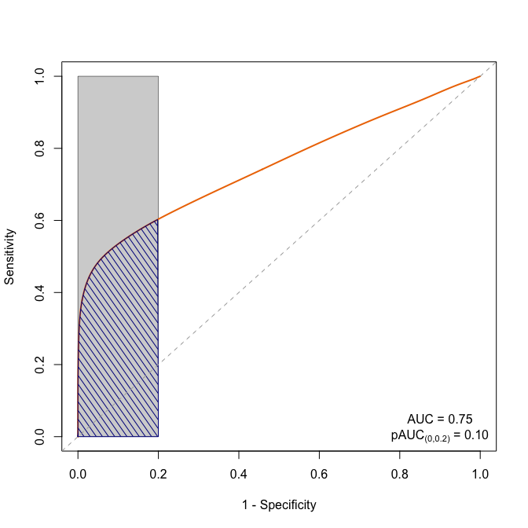

pAUCplotter()
================

``` r
library(pROC)
```

## The Function

``` r
pAUCplotter <- function(
   response, 
   predictor, 
   partial.auc = c(1, .8), 
   partial.auc.focus = "specificity",
   boot.n = 2000, 
   mainTitle = " ",
   progress = "text"
) {
  rocFit  <- roc(response = response, predictor = predictor)
  aucEst  <- rocFit$auc
  aucCI   <- ci.auc(rocFit)
  pAucEst <- auc(rocFit, partial.auc = partial.auc, partial.auc.focus = partial.auc.focus)
  pAucCI  <- ci.auc(rocFit,
    partial.auc = partial.auc, partial.auc.focus = partial.auc.focus,
    boot.n = boot.n, reuse.auc = FALSE, progress = "text"
  )
  smoothed <- smooth(rocFit, method = "density")


  p <- function() {
    plot(0, 0, type = "n", xlab = "1 - Specificity", ylab = "Sensitivity", 
         main = mainTitle, xlim = c(0, 1), ylim = c(0, 1))
    # note: this piece only works for focus == "specificity" right now
    polygon(list(x = 1 - c(partial.auc, rev(partial.auc)), 
                 y = c(0, 0, 1, 1)), col = "lightgray", lwd = .5)
    lines(1 - smoothed$sp, smoothed$se, col = "darkorange2", lwd = 2)
    t1ind <- which.min(abs(smoothed$sp - .8))
    polyvec <- list(
      x = c(1 - smoothed$sp[length(smoothed$sp):t1ind], .2),
      y = c(smoothed$se[length(smoothed$se):t1ind], 0)
    )
    polygon(polyvec, col = "darkblue", density = 15, angle = 125)
    abline(0, 1, lty = 2, col = "darkgray")
  }

  list(
    aucEst  = aucEst, 
    aucCI   = aucCI, 
    pAucEst = pAucEst, 
    pAucCI  = pAucCI, 
    plot    = p
  )
}
```

## Test the function

### Generate Data

``` r
set.seed(234)
ncases <- ncontrols <- 10000 # in each group
y <- c(rep(1, ncases), rep(0, ncontrols))
x1offset <- c(rbeta(ncases, .1, .1), rbeta(ncontrols, .5, 100))
x1 <- as.numeric(scale(x1offset + rnorm(ncases + ncontrols, sd = .3)))
```

### Plot

``` r
fit <- pAUCplotter(y, x1, boot.n = 100)
```

``` r
# pdf("figure1.pdf", width=7, height=7)
fit$plot()
```

<!-- -->

### Plot with extra annotations

``` r
# pdf("figure2.pdf", width=7, height=7)
fit$plot()
text(x = .9, y = .05, 
     labels = paste("AUC =", format(round(fit$aucEst, 2), nsmall = 2)))
text(x = .9, y = 0, labels = substitute(
  paste("pAUC"["(0,0.2)"], " = ", pAucEst),
  list(pAucEst = format(round(fit$pAucEst, 2), nsmall = 2, digits = 2))
))
```

<!-- -->
